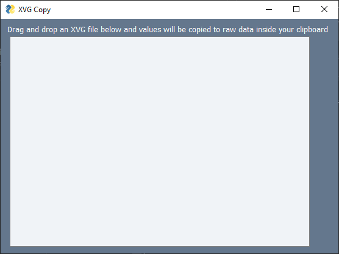

# Copy coordinates from XVG files to your clipboard

Author: Eddy BARRAUD

Contact: <eddy.barraud@outlook.fr>

Public access: [https://github.com/Eddy-Barraud/XVG-to-Clipboard](https://github.com/Eddy-Barraud/XVG-to-Clipboard)

Requirements : pyperclip PySimpleGUIQt

This script is copying coordinates inside XVG files to your clipboard.

It is adding tabulations between values to permit simple paste inside Excel sheets.

Just drag and drop XVG files to the drop zone of the app.
